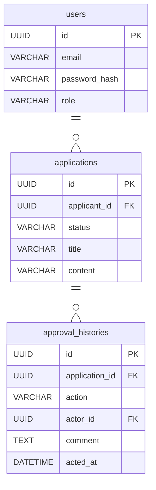

# FlowGate

社内の申請・承認プロセスをデジタル化し、ワークフローを可視化・効率化する管理システムです。

## 技術スタック

### Frontend

- **Framework**: React 18 / TypeScript
- **Tooling**: Vite
- **State Management**: React Query (TanStack Query)

### Backend

- **Framework**: Python 3.10+ / FastAPI
- **Authentication**: JWT (JSON Web Token)
- **ORM/DB**: SQLAlchemy / PostgreSQL

### Infrastructure & Tools

- **Container**: Docker / Docker Compose
- **Database**: PostgreSQL 16
- **Architecture**: REST API

## データベース設計 (ER図)



## 機能一覧

- **認証・認可機能**: ログイン、ユーザー登録、ロール（権限）管理
- **申請管理機能**: 新規申請作成、下書き保存、既存申請の編集・削除
- **承認ワークフロー**: 承認・差し戻し機能、承認履歴の確認
- **ステータス管理**: 申請状況（申請中・承認済・否認等）のリアルタイム表示

## 環境構築

### 前提条件

- Docker / Docker Compose がインストールされていること

### 手順

1. **リポジトリのクローン**
   ```bash
   git clone https://github.com/ShunsukeYamada33/flowgate.git
   cd flowgate
   ```

2. **実行**
    - front, back 共に実行

3. **データベースの初期化**
    - `docs/table.sql` を実行してテーブルを作成します。

## 今後の展望 (Roadmap)

- [ ] **セッション管理**: セッション切れ時の処理の実装
- [ ] **エラー遷移**: エラー発生時の遷移処理の実装
- [ ] **デザイン作成**: CSSの作成